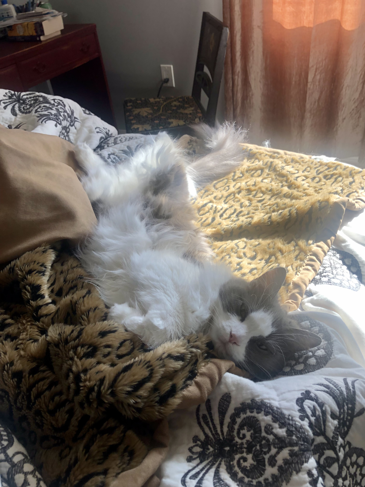

# buttercare-for-her

Thank you so much for taking care of Lady Buttermilk while we're away. Feel free to help yourself to any food/drinks/snacks/etc around the house 😊

## Buttercare Tasks

Caring for Lady Buttermilk involves completing a few recurring quests:
1. Filling her [water](#water)
2. Checking that her [food machine](#food) is still full of food and powered on
3. Checking that her automatic [litterbox]() has been working
4. Loving her

### Water
She has three water sources:
* a water bowl in the walk-in closet room near her food
* a water bowl by the big tub in the master bathroom
* a glass of water on the bedside table

Refill them as needed, give them a rinse every couple days to prevent biofilm.

### Food
She has an automatic food machine. She may try to convince you that she hasn’t been fed. 99% of the time she is lying, but there was one time it didn't go off and she will never forget that.

If she’s being insanely insistent, check to see if the machine is on (text will be visible on the display). If it is, you can either watch the machine when it goes off (at 6am, 1pm, or 11pm), or [trigger a meal](#manually-trigger-a-meal) and see if it works.

If the machine isn’t on, it likely ran out of batteries. Spares are in the big green cabinet by the upstairs bathroom door, in a basket on one of the upper left shelves.

#### Manually trigger a meal

1. Press `OK` so that the screen backlight comes on
2. Press the down arrow two times in moderately quick succession (you will hear a beep with each press)
3. The machine should now dispense about half a meal

### Litter
She has an automatic litter box so you shouldn’t have to do anything besides make sure it’s still working. If there’s no waste in the litter bed you’re good. If there is, the waste drawer may need to be emptied (should go 2-3 weeks without needing to be emptied).

To empty the waste collection drawer, gently pull the step of the litter box forward — the step itself is the handle of a drawer. Tie up the bag and throw it in the trash. Replace bag (spares are behind litter box).

If it does seem broken, contact us. We have a regular litter box and a scoop tucked away somewhere.

## Living In The House
### Garbage and Recycling
*Don’t stress about putting garbage/recycling out for pickup unless you’re worried about running out of space in the big bins.*

The outdoor garbage and recycling bins are in the gravel parking area downstairs. Trash day is every Tuesday, recycling is every other Tuesday. The pickup location is across the street from the gravel lot, by the wood railing and the garden plots.

TODO: photo of bin pickup location

#### Upstairs Garbage Bags
New garbage bags are in a little alcove inside the garbage can and along the back, visible only after you remove the previous bag. If this alcove runs out, more bags are on the floor of the pantry on the far left.

#### Downstairs Garbage Bags
New garbage bags are under the sink

### Compost
*Do whatever your normal trash disposal thing is, but if you would like to compost:*

We have a small indoor bin (on the right side of the upstairs kitchen trash) and a larger 4 gallon outdoor bin on the front porch.

When the indoor bin gets full, you can remove the green bin from inside the metal shell and dump it into the larger bin. Rinse the green indoor bin and when it's dry, new compostable liner bags are on the floor of the pantry to the far left.

Compost gets picked up every other Monday, same week as recycling. Pickup area is on the bottom step of our front steps.

### Adjusting AC / Heat
#### Upstairs
Upstairs has central air. There's a nest thermostat upstairs by the hall bathroom. You can override the upper and lower temperature settings. They'll reset back to scheduled temperatures every night at 10pm and every morning at 10am. If that gets annoying, text Jonathan and he can change the schedule.

#### Downstairs
Downstairs has no AC but does have baseboard heaters. There are three thermostats:
* by the downstairs dining table, controlling the theater, kitchen, and downstairs bathroom
* over the toolbench in the gym, controlling that room
* in the guest bedroom, controlling that room

> :warning: **Before adjusting baseboard heat**:
>
> Make sure nothing is touching any of the baseboard heaters!
>
> In particular, make sure the curtains in the guest bedroom are pulled to the far left and are not touching the heater!

## The Amenities
### Watching movies / playing videogames
Plex is the app Jonathan uses to stream movies and TV. It's installed on the Playstation. To watch movies/TV or play video games, you'll need to turn on all the devices.

*The only buttons you should need to turn everything on and off*

1. Find the black Yamaha remote and white Benq remote.
    - The white remote turns the projector on and off (the only buttons you'll use are the red and green power buttons at the top).
    - The black remote turns on the AV receiver (big black box on the bottom shelf of the media console). The relevant buttons on this remote are the top-right power button and the white volume buttons along the middle of the right side.
    - *A special note are the grey "Input" arrow buttons to the left of the volume buttons. If you can't get any video to come through after turning all the devices on, the receiver may not be tuned to the PS4 channel. Press up or down arrows until the receiver display says "PS4".*
2. Retrieve a Playstation controller from the coffee table drawer.
    - If they need to be charged, there's a micro-USB cable to the left of the media console, on the floor.
3. Turn on the projector, the receiver, and the playstation.
4. Navigate the PS4 menus according to your heart's desire.
    - Plex is in the main screen folder "TV & Video"

### Coffee
#### Drip (Downstairs)
The drip machine downstairs has instructions taped to the equipment. In short:
1. Scoop out the desired amount of coffee (~1 scoop per cup), place in hopper of grinder
2. Push cycle button on grinder; should automatically stop itself when done (push cycle button again if not)
3. Pour coffee grounds into the metal filter cone of the coffee maker
4. Fill water reservoir to desired level
    - Note that the coffee maker will always use all of the water in the reservoir. Do not add more water than you want cups of coffee.
5. Ensure carafe is in place with lid secured
6. Select `CLASSIC` mode.
    - If brewing less than 4 cups of coffee, also select `1-4 CUP` (remember that this is a flavor adjustment and the coffee maker will use all water in the reservoir regardless of this setting)
7. Press `BREW`

#### Espresso (Upstairs)
TODO: espresso machine instructions

### Gym
Feel free to use the exercise equipment. We have a power rack with a bench, a rowing machine, and dumbbells.

### Bike Pump
We have an electric bike pump on the floor near the trash can in the gym (right next to the door). Turn it on, adjust the display to the desired PSI, attach it to your tires, and hold the trigger until it stops itself.

## In Case of Emergency
### Electrical breaker boxes
There are two breaker boxes:
1. In the gym. This controls all electricity upstairs, the water heater, and the gym.
2. In the downstairs dining area. This controls all electricity in the theater, downstairs dining area, kitchen, downstairs bathroom, and downstairs bedroom.

### Water shutoff
The whole-house water shutoff is behind a square white plastic wall panel beneath the bikes in the downstairs hallway. If you don't need whole-house water shutoff, each faucet/toilet/etc has its own shutoff.

### Fire extinguishers
There are two fire extinguishers:
1. In the upstairs kitchen, in the alcove on the floor to the right of the fridge.
2. In the downstairs kitchen, underneath the sink.