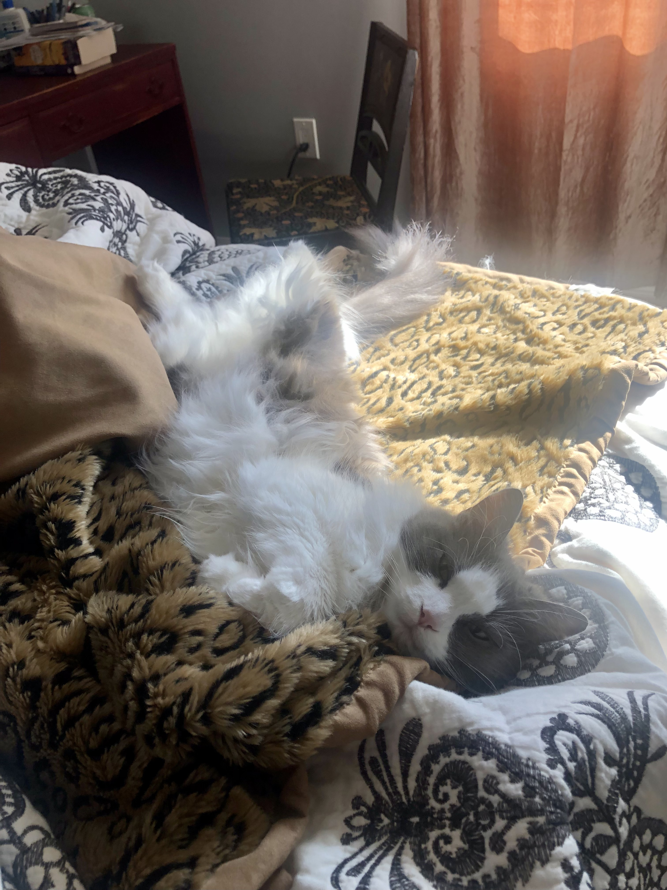

{:.centered width="40%"}

Thank you so much for taking care of Lady Buttermilk while we're away. Feel free to help yourself to any food/drinks/snacks/etc around the house 😊

**Table of Contents**
* TOC
{:toc}

# Buttercare Tasks

Caring for Lady Buttermilk involves completing a few recurring quests:
1. Filling her [water](#water)
2. Checking that her [food machine](#food) is still full of food and powered on
3. Checking that her automatic [litterbox]() has been working
4. Loving her

## Water
She has three water sources:
* a water bowl in the walk-in closet room near her food
* a water bowl by the big tub in the master bathroom
* a glass of water on the bedside table

Refill them as needed, give them a rinse every couple days to prevent biofilm.

## Food
She has an automatic food machine. She may try to convince you that she hasn’t been fed. 99% of the time she is lying, but there was one time it didn't go off and she will never forget that.

If she’s being insanely insistent, check to see if the machine is on (text will be visible on the display). If it is, you can either watch the machine when it goes off (at 6am, 1pm, or 11pm), or [trigger a meal](#manually-trigger-a-meal) and see if it works.

{:.centered width="60%"}

If the machine isn’t on, it likely ran out of batteries. Spares are in the big green cabinet by the upstairs bathroom door, in a basket on one of the upper left shelves.

### Manually trigger a meal

1. Press `OK` so that the screen backlight comes on
2. Press the down arrow two times in moderately quick succession (you will hear a beep with each press)
3. The machine should now dispense about half a meal

## Litter
She has an automatic litter box so you shouldn’t have to do anything besides make sure it’s still working. If there’s no waste in the litter bed you’re good. If there is, the waste drawer may need to be emptied (should go 2-3 weeks without needing to be emptied).

To empty the waste collection drawer, gently pull the step of the litter box forward — the step itself is the handle of a drawer. Tie up the bag and throw it in the trash. Replace bag (spares are behind litter box).

If it does seem broken, contact us. We have a regular litter box and a scoop tucked away somewhere.
